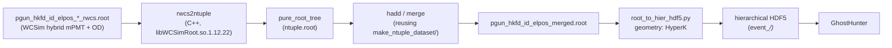
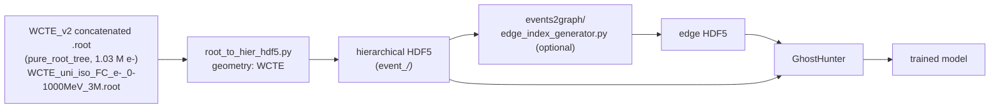

```mermaid
flowchart LR
    WCSim["WCSim 1.12.20<br/>(bquilain build)"]
    R["wcsim_output_*.root<br/>(raw WCSim TTrees)"]
    W2R["WCSimRootToRoot<br/>BigBrother/WCSimRootToRoot-home/1.12.20_corrBen"]
    NRAW["ntuple_raw_*.root<br/>(pure_root_tree, raw)"]
    AC["RootExplorer/bin/apply_cuts_clone"]
    NCUT["ntuple_cut_*.root<br/>(pure_root_tree, cuts applied)"]
    CE["RootExplorer/bin/compute_extra_data_clone"]
    NCED["ntuple_cut_ed_*.root<br/>(adds dwall, towall, ...)"]
    HADD["Hyper-K_merge_and_separate_<br/>ntuple_as_train_val_test.sh"]
    MERGED["merged_e-_50-1500MeV.root<br/>(per train/val/test split)"]
    R2H["root_to_hier_hdf5.py<br/>geometry: HyperK"]
    H5["hierarchical HDF5<br/>(event_<i>/<field>)"]
    GH["GhostHunter"]

    WCSim --> R --> W2R --> NRAW --> AC --> NCUT --> CE --> NCED --> HADD --> MERGED --> R2H --> H5 --> GH
```

# Pipelines overview

End-to-end view of the four ROOT → HDF5 → GhostHunter pipelines that share the
central `pure_root_tree` light-ntuple format. Companion to
`STATE_OF_NTUPLE_MANAGER.md`.

The central pivot is always:

- ROOT TTree `pure_root_tree` (per-event scalars + jagged hit vectors),
- consumed by `mini-Caverns-toolsbox/ntupleManager/root_to_hier_hdf5.py`,
- producing a hierarchical HDF5 with one group per event,
- read by `mini-Caverns-toolsbox/GhostHunter/`.

> **Note (2026-05-23):** Flat and chunked-flat HDF5 producers/converters were removed from
> `ntupleManager/`. Hierarchical won the benchmark; flat comparison code lives in
> `mini-Caverns-benchmarks/`.

The detector-specific differences live in
`mini-Caverns-toolsbox/ntupleManager/utils/geometry_mappings.py`.

---

## Pipeline A — HK FD, pre-existing path (Erwan's old datasets)

### Diagram



### Source files (verified)

```text
$ ls /sps/t2k/eleblevec/Datasets/custom_wcsimroot_datasets/prod_HKFD_ben_1.12.20corr/HyperK_HybridmPMT_WithOD_Realistic/e-/50-1500MeV/1/
config/   logs/                    ntuple_cut_ed_100.root
scripts/  ntuple_cut_100.root      ntuple_raw_100events.root
          wcsim_output_100events.root
```

Per-folder `scripts/runSimu.sh` runs three sub-stages: `wcsim_execute.sh`,
`wcsimroot_to_root_execute.sh`, `root_explorer_execute.sh`. The merge script
in `make_ntuple_dataset/` then consumes the `ntuple_cut_ed_<n>.root` files.

### Upstream extractor (located)

The "external" extractor for these old datasets is **inside the user's own
tree** (not a collaborator package):

| Step | Binary | Source |
|---|---|---|
| WCSim simulation | `/sps/t2k/bquilain/HK/Reconstruction/official_2023/Gonzalo/WCSim-1.12.20/WCSim_build/bin/WCSim` | external (Benjamin Quilain's build) |
| WCSim raw → light ntuple | `/sps/t2k/eleblevec/BigBrother/WCSimRootToRoot-home/1.12.20_corrBen/WCSimRootToRoot/bin/wcsimroot_to_root` | `BigBrother/WCSimRootToRoot-home/1.12.20_corrBen/WCSimRootToRoot/src/wcsimroot_to_root.cc` |
| Apply cuts | `/sps/t2k/eleblevec/BigBrother/RootExplorer/bin/apply_cuts_clone` | `BigBrother/RootExplorer/src/apply_cuts_clone.cc` |
| Add `dwall`/`towall`/extra | `/sps/t2k/eleblevec/BigBrother/RootExplorer/bin/compute_extra_data_clone` | `BigBrother/RootExplorer/src/compute_extra_data_clone.cc` |

`wcsimroot_to_root.cc` reads the WCSim TTrees (`wcsimGeoT` + `wcsimT`) using
`WCSimRootGeom` / `WCSimRootEvent` and writes a TTree named
`pure_root_tree` (configurable via the third-party text config) with the same
schema as the new `rwcs2ntuple` output minus the `dwall`/`towall` fields,
which the `RootExplorer/compute_extra_data_clone` stage adds afterwards.

### Input format (raw WCSim ROOT)

```text
TFile
├── wcsimGeoT (TTree)         # one entry; branch `wcsimrootgeom` of class WCSimRootGeom
└── wcsimT    (TTree)         # one entry per generated event
    └── wcsimrootevent        # branch of class WCSimRootEvent
                              # (single-PMT layouts, no _OD/_2 here)
```

### Schema of the light ntuple (`pure_root_tree`, after `compute_extra_data_clone`)

Per-event scalars: `event_id/I`, `event_type/I`, `creator_process_name`
(std::string), `nb_triggers_in_event/I`, `n_digits_in_trigger_window/I`,
`trigger_time/F`, `trigger_type/I`, `trigger_index/I`, `energy/F`, `vertex[3]/F`,
`vertex_time/F`, `particle_dir[3]/F`, `particle_start[3]/F`,
`particle_stop[3]/F`, `n_digi_hits/I`, `dwall/F`, `towall/F`.

Per-hit fixed-length arrays sized by `n_digi_hits`: `tube_ids[n_digi_hits]/I`,
`hitx[n_digi_hits]/F`, `hity[n_digi_hits]/F`, `hitz[n_digi_hits]/F`,
`pmt_charge[n_digi_hits]/F`, `pmt_time[n_digi_hits]/F`.

(The new `rwcs2ntuple` writes the same scalars but uses
`std::vector<...>` per-hit branches instead of fixed-length arrays. Both are
read identically by uproot via `awkward.Array`.)

### Schema of the merged file

After `Hyper-K_merge_and_separate_ntuple_as_train_val_test.sh`:

```text
/sps/t2k/eleblevec/Datasets/custom_dataset/e-/50-1500MeV/Ndigit_40_1Mevents/
├── test_1_a1000/
│   └── merged_e-_50-1500MeV.root           # ~100 k events, hadd-merged from folders 1..1000
└── train_val_1001_a10000/
    └── merged_e-_50-1500MeV.root           # ~900 k events, hadd-merged from folders 1001..10000
```

Same `pure_root_tree` schema as above, just larger.

### Schema of the HDF5

Hierarchical, written by `utils/hdf5_writer.py::HDF5GraphWriter`:

```text
output.h5
├── attrs: source_file, tree_name, geometry, fields_config
├── event_0/
│   ├── n_digi_hits          (scalar int)
│   ├── energy               (scalar float)
│   ├── event_type           (scalar int)
│   ├── towall, dwall        (scalar float)
│   ├── trigger_time         (scalar float)
│   ├── vertex_x, vertex_y, vertex_z              (scalars, decomposed)
│   ├── particle_dir_x, _y, _z                    (scalars, decomposed)
│   ├── particle_start_x, _y, _z                  (scalars, decomposed)
│   ├── particle_stop_x, _y, _z                   (scalars, decomposed)
│   ├── tube_ids             (1-D int array, length n_digi_hits)
│   ├── pmt_charge           (1-D float array)
│   └── pmt_time             (1-D float array)
├── event_1/
│   └── ...
└── event_<N-1>/
```

Events with `n_digi_hits == 0` are dropped, so HDF5 indices may not be dense
in the absolute event number space.

### Entry-point commands

```bash
# 1. Merge per-folder ntuples into train_val / test sets:
bash mini-Caverns-toolsbox/ntupleManager/make_ntuple_dataset/Hyper-K_merge_and_separate_ntuple_as_train_val_test.sh

# 2. ROOT light ntuple -> hierarchical HDF5 (under SLURM):
bash mini-Caverns-toolsbox/ntupleManager/launch/submit_root_to_hdf5.sh \
    mini-Caverns-toolsbox/ntupleManager/configs/data_extraction_config_e-_train_val_set.yaml
```

### Status

`production`. This is the path that fed every HK FD GhostHunter training run
prior to yesterday.

### Known limitations / open issues

- `creator_process_name`, `event_id`, `trigger_index`, `nb_triggers_in_event`,
  `n_digits_in_trigger_window`, `trigger_type`, `vertex_time` are present in
  the ntuple but not loaded into HDF5 (not in any production `field_config`).
- The merge step uses `hadd`, which keeps the per-event branch layout but
  cannot deduplicate; the input folders must be disjoint by construction.
- `apply_cuts_clone` and `compute_extra_data_clone` read the cylinder geometry
  as **hard-coded** constants in their `.cc` (Erwan, see RootExplorer README:
  "Variables subject to change: Radius, Half_z, maxNumOfHits"). Any change of
  detector dimensions requires recompiling the C++ binaries.

---

## Pipeline B — HK FD, new `rwcs` path (built yesterday)

### Diagram



### Source files (verified)

```text
/sps/hyperk/common/hyperk.org/beta-production/prod_sensitvity_1/pgun/wcsim_v1.12.22_cwcs1.0/HyperK_HybridmPMT_WithOD_Realistic/id_elpos/rwcs/
├── pgun_hkfd_id_elpos_00000000-0000_rwcs.root
├── pgun_hkfd_id_elpos_00000000-0001_rwcs.root
├── ...
```

These are vanilla WCSim hybrid-mPMT + OD outputs (not pre-cut, not pre-merged).

### Input format (rwcs ROOT)

```text
TFile
├── wcsimGeoT          (TTree)   # geometry; branch `wcsimrootgeom` (WCSimRootGeom)
├── wcsimT             (TTree)   # one entry per generated event
│   ├── wcsimrootevent       # branch of class WCSimRootEvent (20" ID PMTs)
│   ├── wcsimrootevent2      # branch of class WCSimRootEvent (mPMT subdetector)
│   └── wcsimrootevent_OD    # branch of class WCSimRootEvent (OD)
└── wcsimRootOptionsT  (TTree)   # job options (one entry)
```

### Extractor

`mini-Caverns-toolsbox/rwcs2ntuple/bin/rwcs2ntuple` (single C++ binary, links
against `/sps/t2k/lrestrepo/S2/WCSimRoot/install/lib64/libWCSimRoot.so.1.12.22`).

- Loops only over `wcsimrootevent` (20" ID PMTs); gates on `TriggerType >= 0`
  per trigger window.
- For each kept event, fills `pure_root_tree` with the central schema:
  - scalars: `n_digi_hits`, `energy` (= track0 KE in MeV), `event_type` (PDG),
    `dwall`, `towall`, `trigger_time`, `vertex[3]`, `particle_dir[3]`,
    `particle_stop[3]`, `particle_start[3]`, `vertex_time`, `trigger_type`,
    `nb_triggers_in_event`, `n_digits_in_trigger_window`, `creator_process_name`.
  - vector branches: `pmt_charge`, `pmt_time`, `tube_ids`, optionally
    `hitx`/`hity`/`hitz` with `--with-hit-positions`.
- `dwall`/`towall` are computed inside the binary from the `WCSimRootGeom`
  cylinder dimensions (no external `compute_extra_data_clone` step needed).

CLI (full doc: `rwcs2ntuple/README.md`):

```bash
./bin/rwcs2ntuple \
    --input  /sps/hyperk/.../rwcs/pgun_hkfd_id_elpos_00000000-0000_rwcs.root \
    --output ./datasets/.../ntuple.root \
    --with-hit-positions \
    --verbose
```

### Existing 994-event smoke dataset

```text
/sps/t2k/eleblevec/mini-Caverns-toolsbox/rwcs2ntuple/datasets/e+_check_plots/
├── ntuples/                                # per-input ntuples
├── pgun_hkfd_id_elpos_merged.root          # 994-event check-plots dataset
└── process.log
```

### Schema of the light ntuple

Same `pure_root_tree` as Pipeline A (drop-in replacement), with two
representational differences:

1. Per-hit branches are `std::vector<...>` (not fixed-length C arrays sized by
   `n_digi_hits`). Uproot reads both as identical jagged awkward arrays.
2. `dwall`/`towall` are written by the extractor itself, not in a downstream
   `compute_extra_data_clone` step.

### Schema of the HDF5

Identical to Pipeline A — the geometry mapping is the same `HyperK` entry, so
the HDF5 layout, dataset names, and `attrs` are byte-compatible with the
Pipeline-A outputs.

### Entry-point commands

```bash
# 1. Convert one rwcs file:
mini-Caverns-toolsbox/rwcs2ntuple/bin/rwcs2ntuple \
    --input  /sps/hyperk/.../rwcs/pgun_hkfd_id_elpos_00000000-0000_rwcs.root \
    --output mini-Caverns-toolsbox/rwcs2ntuple/datasets/<name>/ntuples/<basename>.root \
    --with-hit-positions

# 2. Merge ntuples (re-using make_ntuple_dataset/ or plain hadd):
hadd merged.root <list of ntuples>

# 3. Same downstream as Pipeline A:
bash mini-Caverns-toolsbox/ntupleManager/launch/submit_root_to_hdf5.sh \
    mini-Caverns-toolsbox/ntupleManager/configs/data_extraction_config_e-_train_val_set.yaml
```

### Status

`new`. The 994-event check-plots dataset is the first end-to-end run; the path
to a full 1 M-event train/val set follows the same pattern as Pipeline A.

### Known limitations / open issues

- `--subdetector mpmt` and `--subdetector od` are accepted but exit non-zero
  (not implemented). Only the 20" ID PMTs are used today.
- `charge_profile` / `time_res` are not derivable from rwcs alone and are not
  written.
- `particle_start` is the WCSim GPS source position (~10⁴ cm outside the tank);
  it is schema-faithful to the old ntuples but should not be interpreted as a
  vertex.
- A benign streamer-info warning may print once (rwcs files were written with
  ROOT 6.28; readers using 6.30 still parse them cleanly).
- The merge wrapper in `make_ntuple_dataset/` was written for the old
  `ntuple_cut_ed_<n>.root` per-folder layout. For Pipeline B the input is a
  flat directory of `*_rwcs2ntuple.root` files; either adapt the wrapper or
  call `hadd` directly.

---

## Pipeline C — WCTE (Mathieu Férey's MC, mostly on `/sps/hyperk/mferey`)

**WCTE — pure-Python pipeline; no `rwcs` extractor needed for the v2 dataset.**
The production v2 file is **already a light ntuple** (`pure_root_tree`,
1 034 313 entries) and is read directly by `root_to_hier_hdf5.py` with
`geometry: WCTE`. No new C++ tool is required.

### Diagram



### Datasets

#### Primary production dataset (~1 M events, owner's target)

```text
/sps/hyperk/mferey/Data/WCTE_v2/Concatenated/
└── WCTE_uni_iso_FC_e-_0-1000MeV_3M.root      # ~8.0 GB, pure_root_tree, 1 034 313 entries
```

This file lives on `/sps/hyperk/`; it was moved off `/sps/t2k/mferey` via
`Data/transfer_hk.sh`. Existing CAVERNS YAML configs still reference the old
`/sps/t2k/mferey/Data/WCTE_v2/Concatenated/` paths and **must be updated**
(see "Known limitations" below).

#### Secondary smaller dev/debug datasets (still on `/sps/t2k/mferey`)

```text
/sps/t2k/mferey/WCSim2ML/Simulation/RootOutput/WCTE_e-_200-1000MeV_20000_v1.12.18/
└── 10 files × 2 000 events = ~20 k events     # pure_root_tree, same WCTE camelCase schema

/sps/t2k/mferey/WCSim2ML/Data/WCTE/e-_200-1000MeV_10k/
└── 10 files                                    # legacy: TTree is `root_event` (NOT pure_root_tree)
```

Useful as small slices for development without crossing filesystems. The
legacy 10 k dataset uses a different TTree name (`root_event`) and therefore
needs `tree_name: "root_event"` in the YAML config (this works — the
converter reads `tree_name` from the YAML; see "Known limitations").

#### Raw-WCSim sources (also exist, on `/sps/hyperk/`)

```text
/sps/hyperk/mferey/Data/WCTE_v1/.../e-/
├── ~550 wcsim_output_2000events.root          # raw WCSim TTrees: wcsimT, wcsimGeoT, wcsimRootOptionsT
└── per-job root_output_*.root                 # already-converted light ntuples

/sps/hyperk/mferey/Data/WCTE_beam/.../e-/350-450MeV/
└── beam-line MC, 100 events/job, raw + converted (not the recommended path)
```

These are the upstream "before-WCSimRootToRoot" version of the data. Use the
v2 concatenated light-ntuple file above unless there is a specific reason to
re-extract (e.g. fixing a bug in the upstream conversion).

### Input format (`pure_root_tree` in the v2 file)

Verified branches in `WCTE_uni_iso_FC_e-_0-1000MeV_3M.root` and their
counterparts in `utils/geometry_mappings.py:48-74` (the WCTE entry):

| WCTE branch (in v2 file) | Standard HDF5 name | Notes |
|---|---|---|
| `eventType` | `event_type` | camelCase in WCTE |
| `n_hits` | `n_digi_hits` | different name in WCTE |
| `energy` | `energy` | identity |
| `time_trigger` | `trigger_time` | different name in WCTE |
| `vertex` | `vertex` (decomposes to `vertex_x/y/z`) | identity |
| `particleDir` | `particle_dir` (decomposes to `particle_dir_x/y/z`) | camelCase in WCTE |
| `charge` | `charge` (and aliased to `pmt_charge`) | identity + alias |
| `time` | `time` (and aliased to `pmt_time`) | identity + alias |
| `hitx`, `hity`, `hitz` | `hitx`, `hity`, `hitz` | identity |
| `tubeIds` | **(no entry in WCTE mapping — see discrepancy below)** | WCTE-specific PMT ids |
| `mPMTtubeIds` | **(no entry in WCTE mapping — see discrepancy below)** | WCTE-specific (all-mPMT geometry) |

Branches that the WCTE mapping declares but **the v2 file does not contain**:
`towall`, `dwall`, `particleStop`, `particle_start` (the last is already
mapped to `None`). `apply_geometry_mapping` will warn and skip them; they
will be absent from the HDF5.

(Source for the mapping: `utils/geometry_mappings.py:48-74`.)

> **Branch-mapping discrepancy noted (verified by reading
> `utils/geometry_mappings.py`):**
>
> 1. The WCTE entry has **no `tube_ids` row at all** (the HyperK entry has
>    `'tube_ids': 'tube_ids'`). Because `apply_geometry_mapping` iterates over
>    the keys of the per-geometry mapping (not over the user's `field_config`),
>    putting `tube_ids` in a WCTE config is silently ignored — the column will
>    not be loaded. **Fix:** add a `'tube_ids': 'tubeIds'` row (and likely an
>    `'mPMT_tube_ids': 'mPMTtubeIds'` row) to the WCTE entry before running
>    a WCTE conversion that needs PMT identity.
> 2. WCTE is all-mPMT (no 20" PMTs); the file therefore has both `tubeIds`
>    and `mPMTtubeIds`. The mapping author must decide which one is "the"
>    `tube_ids` consumed downstream. GhostHunter's `extra_data/` folder
>    contains `hyperk_20inch_pmts.npz` and `pmt_distance_matrix*` only —
>    **no `wcte*` NPZ exists today**. A WCTE PMT geometry NPZ will need to
>    be produced before GhostHunter can interpret these tube ids spatially.
> 3. The v2 file does not contain `towall` / `dwall` / `particleStop`. If
>    GhostHunter needs them, they must either be (a) added in a small
>    post-processing step analogous to `RootExplorer/compute_extra_data_clone`,
>    or (b) dropped from the `field_config` for WCTE.

### Output format (HDF5)

Same hierarchical layout as Pipelines A and B
(`event_<i>/<standard_field>`, gzip-compressed, scalars uncompressed,
metadata in root attrs). WCTE-specific differences:

- The `tube_ids` dataset will be in the **WCTE PMT id space**, not the HyperK
  20" tube id space, and is therefore not interchangeable with HK FD HDF5s
  for any PMT-position lookup.
- No OD layer — WCTE has a single subdetector.
- `particle_start`, `particle_stop`, `towall`, `dwall` will be absent unless
  the v2 file is regenerated to include them or a post-processing step is
  added.

### Entry-point command

```bash
python /sps/t2k/eleblevec/mini-Caverns-toolsbox/ntupleManager/root_to_hier_hdf5.py \
    --config configs/<WCTE_config>.yaml
# config must set: geometry: WCTE, tree_name: pure_root_tree (or root_event for the legacy 10k dataset),
# and input_file: /sps/hyperk/mferey/Data/WCTE_v2/Concatenated/WCTE_uni_iso_FC_e-_0-1000MeV_3M.root
```

A minimal working YAML (current `field_config` schema, not the deprecated
`scalar_fields_config` / `vector_fields_config` one) looks like:

```yaml
geometry: "WCTE"
tree_name: "pure_root_tree"        # use "root_event" for the legacy 10k dataset
input_file: "/sps/hyperk/mferey/Data/WCTE_v2/Concatenated/WCTE_uni_iso_FC_e-_0-1000MeV_3M.root"
output_file: "/sps/t2k/eleblevec/Datasets/.../wcte_v2_e-_0-1000MeV.h5"
field_config:
  - "n_digi_hits"
  - "energy"
  - "event_type"
  - "trigger_time"
  - "vertex"
  - "particle_dir"
  - "pmt_charge"
  - "pmt_time"
  - "hitx"
  - "hity"
  - "hitz"
  # particle_start, particle_stop, towall, dwall intentionally omitted:
  # not present in the v2 file (see discrepancy note above).
  # tube_ids would also be needed but the WCTE mapping has no row for it today.
storage_mode: "hierarchical"
compression: "gzip"
uproot_step_size: "20000"
```

### Status

`production-ready` — no new code required for the v2 dataset; only a fresh
YAML config is needed. The two open code-side items are (a) adding a
`tube_ids` / `mPMTtubeIds` row to the WCTE mapping, and (b) producing a WCTE
PMT geometry NPZ for GhostHunter.

### Known limitations / open issues

- **Stale CAVERNS configs.** Existing CAVERNS YAML configs reference
  `/sps/t2k/mferey/Data/WCTE_v2/Concatenated/...`, but the production v2 file
  has been moved to `/sps/hyperk/mferey/Data/WCTE_v2/Concatenated/...`
  (relocation done via `Data/transfer_hk.sh`). Either update the configs
  in-place or read the path from an environment variable indirection.
- **Five existing `*WCTE*` configs are silently broken.** They use the
  deprecated `scalar_fields_config` / `vector_fields_config` schema and
  produce empty HDF5 outputs with the current `root_to_hier_hdf5.py` (which
  reads `field_config` only, line 71). Already flagged in
  `STATE_OF_NTUPLE_MANAGER.md`, Section 3 — write a fresh config rather than
  editing those.
- **Legacy 10 k dataset uses a different TTree name (`root_event`).** This is
  a one-line YAML override, **not** a code change: `root_to_hier_hdf5.py:308`
  reads `tree_name = config.get('tree_name', 'pure_root_tree')`, so setting
  `tree_name: "root_event"` in the YAML is sufficient.
- **`tubeIds` / `mPMTtubeIds` are not in the WCTE mapping today** (see the
  discrepancy block in the input-format table). A two-line patch to
  `utils/geometry_mappings.py:48-74` is needed before any WCTE run that
  requires PMT identity downstream.
- **No WCTE PMT geometry NPZ in `GhostHunter/extra_data/`** (only
  `hyperk_20inch_pmts.npz`). One must be produced — likely from a WCTE
  geometry dump — before GhostHunter can position WCTE hits in 3-D.
- **`particle_start` is missing in WCTE** (mapped to `None`); consumers must
  tolerate its absence. `particle_stop`, `towall`, `dwall` are mapped but
  not present in the v2 file — they must either be added in a
  post-processing step or dropped from the WCTE `field_config`.

---

## Pipeline D — SK or other detectors

There is **no evidence** in the package today that SK is being prepared:

- `utils/geometry_mappings.py` only defines `HyperK` and `WCTE`.
- No SK config exists under `configs/`.
- No SK reference in any of the launch / merge scripts.
- The closest mention is `geofile_SuperK.txt` in the per-job `scripts/`
  folders of the HK FD dataset directories — that is a WCSim auxiliary input
  file, not a pipeline indicator.

When SK gets added, the change will be:

1. New entry `'SK': { ... }` in `utils/geometry_mappings.py`.
2. New `configs/data_extraction_config_*_SK_*.yaml`.
3. Either reuse `rwcs2ntuple` (if the input is raw WCSim) or point
   `root_to_hier_hdf5.py` directly at an existing SK light ntuple.

(See `doc/GEOMETRY_MAPPING_README.md` for the "adding a new geometry"
recipe.)

---

## Cross-pipeline comparison

| Pipeline | Input format | Extractor | Light ntuple location | HDF5 step | Status |
|---|---|---|---|---|---|
| HK FD pre-existing | external `ntuple_cut_ed_*.root` (already light) — sourced from raw WCSim → `WCSimRootToRoot` → `RootExplorer`, all under `/sps/t2k/eleblevec/BigBrother/` | `BigBrother/WCSimRootToRoot-home/.../wcsimroot_to_root` + `BigBrother/RootExplorer/bin/{apply_cuts_clone,compute_extra_data_clone}` (user's own C++; not part of `mini-Caverns-toolsbox/`) | `/sps/t2k/eleblevec/Datasets/custom_wcsimroot_datasets/prod_HKFD_ben_1.12.20corr/.../ntuple_cut_ed_*.root` and merged at `/sps/t2k/eleblevec/Datasets/custom_dataset/e-/50-1500MeV/Ndigit_40_1Mevents/{train_val_1001_a10000,test_1_a1000}/merged_e-_50-1500MeV.root` | `root_to_hier_hdf5.py` (HyperK) | production |
| HK FD rwcs | `pgun_hkfd_id_elpos_*_rwcs.root` (raw WCSim hybrid mPMT + OD) at `/sps/hyperk/common/hyperk.org/beta-production/prod_sensitvity_1/pgun/wcsim_v1.12.22_cwcs1.0/HyperK_HybridmPMT_WithOD_Realistic/id_elpos/rwcs/` | `mini-Caverns-toolsbox/rwcs2ntuple/bin/rwcs2ntuple` (C++, single binary) | `mini-Caverns-toolsbox/rwcs2ntuple/datasets/e+_check_plots/pgun_hkfd_id_elpos_merged.root` (994-event smoke dataset) | `root_to_hier_hdf5.py` (HyperK) | new |
| WCTE (v2 prod) | `pure_root_tree` (already light ntuple, WCTE camelCase names) | none needed | `/sps/hyperk/mferey/Data/WCTE_v2/Concatenated/WCTE_uni_iso_FC_e-_0-1000MeV_3M.root` (≈8.0 GB, 1 034 313 entries) | `root_to_hier_hdf5.py` (WCTE) | ready (no extractor needed; new YAML config required) |
| WCTE (dev 20k) | `pure_root_tree` (small) | none needed | `/sps/t2k/mferey/WCSim2ML/Simulation/RootOutput/WCTE_e-_200-1000MeV_20000_v1.12.18/*.root` (10 files × 2 000 events) | `root_to_hier_hdf5.py` (WCTE) | ready |
| WCTE (legacy 10k) | TTree `root_event` (NOT `pure_root_tree`) — same WCTE camelCase branches | none needed | `/sps/t2k/mferey/WCSim2ML/Data/WCTE/e-_200-1000MeV_10k/` (10 files) | `root_to_hier_hdf5.py` (WCTE) with YAML `tree_name: "root_event"` | ready |
| WCTE (raw WCSim) | `wcsimT` / `wcsimGeoT` / `wcsimRootOptionsT` | port `rwcs2ntuple` to WCTE geometry (todo) | `/sps/hyperk/mferey/Data/WCTE_v1/.../e-/wcsim_output_2000events.root` (~550 files) | `root_to_hier_hdf5.py` (WCTE) | not recommended (use v2 prod instead) |
| SK / other | n/a | n/a | n/a | n/a | not started |
